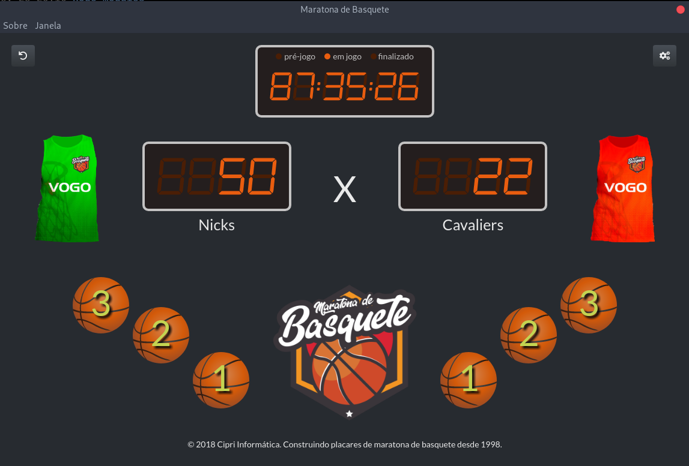

# scoreboard

This is a scoreboard for Basketball Marathons. A Basketball Marathon is a basketball game that's played for more than 24 hours, between 2 teams with more than 50 people in each. It's a continuous play, with 5 people per team in court all the time.

Usually scores goes beyond 1000 so the software needs to support that amount of digits, auto save game and a countdown clock.

## Architecture

This app is built with:

* ES6 javascript
* [Electron](https://electronjs.org/)
* [Semantic UI](https://semantic-ui.com/)
* [jQuery](https://jquery.com/), yes, and it felt good...
* [Segment Display](http://www.3quarks.com/en/SegmentDisplay/) lib
* [neDB](https://github.com/louischatriot/nedb) javascript database

For development: [eslint](https://eslint.org/), [jasmine](https://jasmine.github.io/) and [electron-builder](https://github.com/electron-userland/electron-builder)

## Setup

    $ make setup

## Tests

    $ make

Will run eslint (`make lint`) and jasmine tests (`make test`).

## Run development version

    $ make start

## Build

The build is configured only for Windows, but its not hard to do for other OSs. Check electron-builder documentation.

To build run:

    $ yarn dist

And check `./dist` folder
